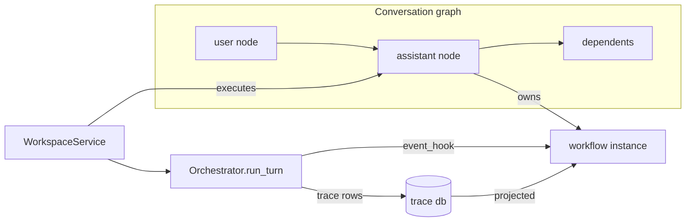

# Executing the graph: node execution and output processing

This execution-trace analysis covers the other half of the workspace: what
happens *after* a message exists as graph nodes. It explains how nodes execute,
how their outputs are written and propagated, how edits cascade, how paused and
held work continues, and how recorded evidence is projected back onto the
workflow graph the user sees.

Two graphs are involved, and they execute differently:

- The **conversation graph** (`workspace_nodes` / `workspace_edges`) contains
  message, context, and store nodes connected by dependency edges. Its
  "execution" consists of running assistant nodes one at a time within each
  conversation, plus a stale → recalculate cascade when an upstream value
  changes.
- The **per-message workflow instance** (`workspace_workflows`) is each
  assistant node's private copy of a flow graph. It does not execute itself;
  the engine (`Orchestrator`) runs, while the instance serves as a live
  *projection surface*. Engine events move a cursor (`active_node` and each
  node's `runtime_status`) through the declared stages.



---

## CFG 1: the node status machine

```python
# The statuses a workspace node can have, and what each one means
NODE_STATUSES = {
    "draft",              # store/checkpoint nodes that were created but never run
    "queued",             # assistant node waiting for its background task
    "running",            # the engine is working on it now
    "awaiting_input",     # a human_input workflow node blocks before any spend
    "awaiting_approval",  # the governor durably holds a proposed action
    "paused",             # the user pressed pause; the asyncio task was cancelled
    "complete",           # output_text is final and available to dependents
    "stale",              # upstream data changed; the output is no longer trustworthy
    "failed",             # execution stopped without producing usable text
    "needs_attention",    # text exists, but the engine escalated it (weak/unverified)
    "cancelled",          # terminal; recalculation walks skip it
}
# Exactly three writers set these transitions:
#   WorkspaceService        — queued/running/awaiting_*/paused/complete/failed/needs_attention
#   update_node             — an upstream edit marks the node and its dependents "stale"
#   invalidate_descendants  — cascades invalidation, skipping paused/cancelled nodes
```

- The key asymmetry is that `stale` is not an error. It means "the inputs used
  to compute this output have changed." The node keeps its old `output_text`
  until recalculation overwrites it, allowing the UI to show the previous
  answer while the new one is pending.
- `paused` and `cancelled` act as shields: the invalidation cascade never
  overwrites them, so pausing a node protects it from upstream churn.

## CFG 2: executing one assistant node — the output side
(`workspace.py::_execute_assistant`; the prompt-assembly input side is covered
in the companion document `message-arrival-trace.md`)

```python
async def _execute_assistant(node_id, job_id):
    workflow = store.workflow(instance_id)
    plan = store.workflow_plan(instance_id)   # summarize ENABLED workflow nodes:
    #   ensemble configuration, unsatisfied human_input, executor/context prompts,
    #   verification prompts, and store_read / store_write node lists
    set_node_status(node_id, "running")
    set_workflow_runtime(instance_id, status="running", active_node=entry)

    if plan["human_input_node_id"]:           # gate BEFORE any model spend
        set_node_status(node_id, "awaiting_input",
                        config={"awaiting_workflow_node": human_node_id})
        return "awaiting_input"

    ... assemble prompt, perform store reads ...

    report = await orchestrator.run_turn(..., event_hook=on_event)
    # on_event maps every engine event to a workflow stage and writes it through
    # set_workflow_runtime. It marks the previous stage "complete" and the new
    # stage "running", which animates the graph in the UI:
    #   ensemble_*                   -> the ensemble node (or first agent node)
    #   execute / synthesis          -> first agent node
    #   verify / verify_error        -> first verifier/checker node
    #   contract / plan / fm_event   -> ingress/policy node
    #   turn_end                     -> terminal node

    pending = action_store.list(status="human_pending") filtered to this session+task
    outcome = ("awaiting_approval" if pending
               else "failed"          if report.escalated and not report.text
               else "needs_attention" if report.escalated
               else "complete")
    rendered = (approval_notice if awaiting_approval
                else failure_notice if outcome == "failed"
                else report.text)
    set_workflow_runtime(instance_id, status=outcome,
                         active_node=approval_node if awaiting_approval else terminal)
    set_node_status(node_id, outcome, output_text=rendered,
                    run_id=report.task_id,
                    config={"task_id", "executor", "score", "cost_usd",
                            "attempts", "escalated", "pending_action_ids"})

    if awaiting_approval: return           # a HELD proposal is not output evidence;
                                           # suppress store writes until an approved
                                           # re-run reaches a real terminal state
    for write_node in plan.store_writes + direct_child_store_write_nodes:
        store.save_record(store_id, report.text,
                          source_node_id=node_id,
                          metadata={"session", "task_id", "save_prompt"})
    maybe_generate_title(...)              # only for the first completed turn;
                                           # a human rename is rechecked and always wins
```

- Outcome classification is the single point where engine results become
  graph facts. Each case preserves different information:

  - **`complete`** — `output_text` contains the verified answer; `config`
    contains the audit trail (task ID, executor, score, cost, and attempts).
  - **`needs_attention`** — the text is preserved, while the escalation string
    is stored in `config.escalated`; dependents may still consume the output.
  - **`failed`** — `output_text` is replaced with an explanation of why no text
    was produced, preventing downstream prompts from silently inheriting an
    empty answer.
  - **`awaiting_approval`** — `output_text` becomes an instruction to review
    the held action, and `config.pending_action_ids` links the node to durable
    action records. The action store—not the response prose—is authoritative:
    a model can *say* "I need approval," but only a durable `human_pending` row
    can stop and later release approval-gated execution.

## CFG 3: the edit → invalidate → recalculate cascade

```python
def edit_node(node_id, patch):                          # workspace.py
    if patch is only position_x/position_y:
        set_position(...); return          # dragging changes layout only: NO revision,
                                           # NO invalidation, and NO re-execution
    edited = store.update_node(node_id, patch)          # conversation_graph.py:
    #   1. write the PREVIOUS input/output/config to workspace_node_revisions
    #      (the undo/audit ledger), then increment revision
    #   2. if an assistant node's input_text was edited, set input_inherited=False
    #      (it now owns its prompt) and mark its status "stale"
    #   3. if a user node has output_inherited, keep output_text synchronized with
    #      input_text unless the output was explicitly patched
    #   4. invalidate_descendants: mark every downstream node "stale"
    #      (except paused/cancelled nodes); mark their workflow instances "stale"
    #      and clear the stage cursor
    if anything went stale: job = create_job(kind="recalculate"); spawn _recalculate

async def _recalculate(root_node_id, job_id, include_root):
    nodes = ([root] if include_root else []) + descendants(root)
    nodes.sort(by=(ordinal, node_id))      # creation order approximates topology
    async with conversation_lock:          # one execution at a time per conversation
        for node in nodes:
            update_job(progress={completed, total, current_node_id})
            if node.role == "assistant":
                outcome = await _execute_assistant(node)
                if outcome in {awaiting_input, awaiting_approval,
                               failed, needs_attention}:
                    update_job(status=outcome); return   # STOP the walk here;
                    # later nodes remain "stale" until the blocker clears
            elif node.status == "stale":
                set_node_status(node, "complete")        # context/store nodes have
                                                         # nothing to recompute
        update_job(status="complete")
```

- `feeds` wires participate fully. Creating or deleting a `feeds` edge marks
  the target stale and invalidates its dependents, so changing an explicitly
  wired input reruns its consumers just like changing a lineage input.
- The walk follows `ordinal`, which reflects creation order rather than a
  topological sort of the edges. The two orders coincide in linear
  conversations, and the guarantee holds for lineage: a child is always created
  after its parent, and the cycle check rejects wiring a later node's output
  back into one of its own ancestors. A known limitation applies to
  cross-branch `feeds` wires, which may connect a later-created source to an
  earlier-created consumer in a sibling branch. If a shared upstream edit
  invalidates both branches, the ordinal walk runs the earlier consumer before
  the later feed source. The consumer therefore re-executes against the feed's
  stale output and is not marked stale again when the source finishes.

## CFG 4: how outputs propagate to consumers

```python
# A completed node's output_text reaches other computation in four ways:
1. lineage      — prompt_messages() renders it for every downstream assistant
                  as a chat turn or system block (through structural edges)
2. feeds wires  — non-lineage consumers receive it as an explicitly wired
                  system block without inheriting this node's ancestry
3. store writes — save_record() copies it to a knowledge store with
                  source_node_id provenance; later store_read nodes retrieve
                  it by similarity for prompts in OTHER conversations
4. revisions    — every superseded output remains in workspace_node_revisions,
                  so the previous text from before an edit/re-run is recoverable
```

## CFG 5: continuing stopped work — pause, resume, approval

```python
def pause(node_id):                        # the user pressed pause
    task.cancel()                          # raises CancelledError inside the executor
    set_node_status(node_id, "paused"); workflow "paused"; jobs "paused"
    # Workspace pause cancels this task; it does not set the global control.paused flag.

def resume(node_id):                       # button click, or automatic after approval
    if a task is already running: return already_running
    set_node_status(node_id, "queued"); job = create_job(kind="resume")
    spawn _run_assistant(node_id)          # fully re-execute THIS node:
    # the engine reruns the turn from its graph inputs; the decided action is no
    # longer "human_pending", so the outcome classification can proceed

# POST /admin/workspace/actions/{action_id}/decision      (approve or deny)
async def admin_workspace_action_decision(action_id, body):
    node = assistant node whose config.task_id == action.task   # found FIRST,
    action = resolve_action_decision(...)  # durable state change: human_pending ->
                                           # human_approved / human_denied (+ note)
    continuation = workspace_service.resume(node)   # continue the message
    return {action, workspace_node_id, continuation}
```

Workspace pause cancels the node's asyncio task, stopping execution at the next
await point. Separately, `control.paused` is the operator-level global pause
that the engine checks at every spend boundary. These mechanisms prevent new
work from starting past the next boundary; they do not undo or recall work
already in flight. An in-progress provider call is abandoned and its response
discarded, a tool action already released to the client cannot be pulled back,
and remotely launched sandbox work may continue until its own cleanup runs.

- Approval is a durable state change, not a mode change. The decision is
  recorded on the action row, and the resumed workspace turn no longer finds a
  `human_pending` hold. The stricter one-shot mechanism—releasing the *exact
  stored response* that was held, byte for byte, instead of regenerating it—
  belongs to the tool-turn surface, where the governor holds a concrete
  proposed tool call (`release_operator_approved`). Denial notes appear in
  later tool turns as operator guidance.
- `awaiting_input` continues in the same way: the operator satisfies the
  `human_input` workflow node by using the workflow-node edit endpoint to set
  `satisfied: true`, then resumes the message. The plan no longer reports a
  blocking human node.

## CFG 6: projecting recorded evidence back onto the graph
(`proxy.py::_workspace_workflow_execution`—what "Expand run" shows)

```python
def _workspace_workflow_execution(instance_id, include_payloads):
    workflow, owner = load instance and its assistant node
    task = owner.config.task_id            # the engine turn used for this message

    trace_events = trace.task_events(session, task)     # the forensic ledger
    projected = [{**event, "node_id": _workspace_stage_for_event(workflow, kind)}
                 for event in trace_events]
    # _workspace_stage_for_event maps trace vocabulary to declared stages:
    #   execute/synthesis/unit_done   -> first agent node
    #   verify/verify_error           -> first verifier/checker node
    #   tool_step/tool_result         -> first tool node
    #   contract/plan/policy/fm_event -> ingress/policy node
    #   soundness_*                   -> soundness checker node
    #   turn_end                      -> completed terminal
    # Events without a mapping keep node_id=None and appear as unplaced.

    run = flow_runtime run matching (flow_id, session, task)   # if the engine
    route = run.events or [e for e in projected if e.node_id]  # ledger wins
    observed_sequence    = ordered stage ids from route
    observed_transitions = consecutive (before, after) pairs, dedup-adjacent
    # These values drive the UI: which stages light up and which edges are "observed".

    model_steps = for each upstream exchange (a real provider call, stored
                  with request/response payloads), match the nearest LATER
                  trace event with the same model -> attach stage, tokens,
                  cost, and (only when include_payloads) the exact input and
                  output of that call
    return summary                          # always include counts; include payloads
                                            # only for the on-demand execution endpoint
```

- Two evidence sources produce one picture. The flow-runtime ledger, which
  records validated transitions as they happen, takes precedence for the
  route. The trace, which contains every logged event for the turn, supplies
  stages, counts, and model attribution. When no runtime was recorded—for
  example, for historical imports or engine paths that predate the runtime—
  the mapped trace alone can still show the observed path.
- Payload loading is deliberately lazy. The graph endpoint sends only counts
  and the observed route (`include_payloads=False`); the full input and output
  of each model call load only when the user expands that workflow's execution.

---

## Data structures, defined by what they mean

- **`workspace_node_revisions` row** — one superseded version of a node. It
  stores the input, output, and configuration as they were *before* an edit,
  along with the revision number, the reason (for example, "user edit"), and
  the time of the change. This record preserves the previous content whenever
  an edit overwrites the current version.
- **`workflow_plan` result** — the executable summary of one workflow instance,
  computed from its *enabled* nodes. It includes the ensemble configuration and
  node ID, if present; the ID of any required but unsatisfied `human_input`
  node; prompts supplied by agent and context nodes; verification requirements
  supplied by checker, critic, and verifier nodes; and the lists of store-read
  and store-write nodes. The engine receives this plan rather than the raw
  graph.
- **`runtime_status` (per workflow-graph node)** vs. **node `status`** — two
  separate lifecycles. A conversation node's `status` records its durable
  workflow state (`queued`, `complete`, `stale`, and so on). A workflow-graph
  node's `runtime_status` acts as the current run's live cursor (`idle` →
  `running` → `complete` / `awaiting_*`) and is rewritten on every execution.
- **`execution_summary`** — the digest that is always sent for a message's run.
  It records the stages observed (`observed_nodes`), their order
  (`observed_sequence`), the stage-to-stage transitions that actually occurred
  (`observed_transitions`), the cursor's current location (`current_node`), the
  counts of engine events and real model calls, and the task and run IDs that
  link the summary to the underlying ledgers.
- **`model_steps`** — one record per real provider call in the expanded view.
  Each record identifies the workflow stage, model, token counts, and cost. On
  demand, it also includes the exact request and response payloads.
- **action record** (`human_pending` row) — a durable record of a proposed
  action. It contains the proposing session and task; the exact tool call and
  its declared targets, postcondition, invariants, and rollback; the assessed
  risk; and, later, the human decision and note. It is the only authority that
  can hold and release an approval-gated action; response text that merely
  claims a pause has no authority.
- **`workspace_jobs.progress`** — `{completed, total, current_node_id}`. It
  reports how far a send, resume, or recalculation walk has progressed; which
  node is active; and how many remain. The UI polls it to display progress.
- **conversation lock** — one asyncio lock per conversation within
  `WorkspaceService`. It serializes all sends, resumes, and recalculation walks
  for a session, preventing two runs from interleaving writes to the same
  lineage. Different conversations can run concurrently.
- **`event_hook`** — the callback that `run_turn` invokes for every logged
  event. The workspace uses it to move the workflow cursor in real time. A
  wrapper ensures that a UI projection error cannot fail a model turn.

---

## Special-case index (one line each, with trigger likelihood)

| Case | Where | You hit it when… | Likelihood |
|---|---|---|---|
| drag = no re-run | edit path | patch touches only position | every drag |
| stale keeps old output | cascade | upstream edit before recalc finishes | every edit window |
| paused shields from cascade | cascade | node paused, upstream edited | whenever paused |
| recalc stops mid-walk | recalc | a node fails / needs approval / needs input | any blocking node |
| store write suppressed | output | outcome is awaiting_approval | every held action |
| failed output is an explanation | output | escalation with empty text (outage etc.) | rare |
| needs_attention keeps text | output | escalation with usable text | occasional |
| title generation skipped | output | conversation already human-named, or approval pending | common |
| resume no-ops | continuation | task already running for that node | double-click races |
| approval auto-continues | continuation | decision posted via workspace endpoint | every inline decision |
| human_input release | continuation | workflow node patched satisfied, then resume | only if node added |
| unplaced trace events | projection | event kind has no stage mapping | niche kinds |
| trace-only route | projection | no flow-runtime run matched (imports, legacy) | historical messages |
| payloads on demand | projection | user expands a workflow run | every expand |
