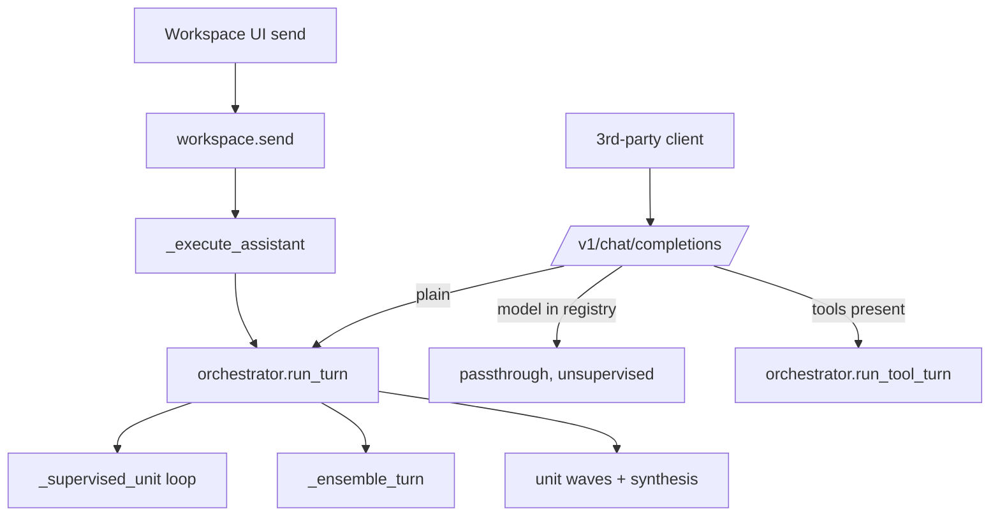

# What happens when a message arrives

An execution trace of Conflux's message-arrival pipelines: every function
on the path, every data structure it populates, and every special case,
including the conditions that trigger it.

Messages enter the system through three surfaces. All three share the same
engine (`Orchestrator`), but their initial paths differ substantially:

- **Surface 1 — Workspace message** (`POST /admin/workspace/conversations/{session}/messages`).
  This is the product path. The server owns the conversation as a graph, and
  the client sends only the new text.
- **Surface 2 — OpenAI-compatible plain turn** (`POST /v1/chat/completions`,
  no tools). This is a stateless "one supervised turn as a model" adapter.
  The client owns the conversation and resends the full transcript with each
  request.
- **Surface 3 — OpenAI-compatible tool turn** (`POST /v1/chat/completions`
  with `tools`). An agent client, such as OpenCode or Hermes, drives the turn;
  every proposed tool call passes through the action governor before release.



---

## Surface 1 — a message arrives in the Workspace

### CFG 1a: request → queued execution (`proxy.py` → `workspace.py` → `conversation_graph.py`)

```python
# POST /admin/workspace/conversations/{session}/messages   (returns 202 immediately)
def send(session, content, *, parent_id=None, flow_id="auto"):        # workspace.py
    # -- choose the workflow graph that will process this message --
    if flow_id == "synthesize":
        base_flow = DEFAULT_FLOW_ID          # temporary graph shape until synthesis runs
        decision = {"mode": "synthesize", "status": "pending_synthesis"}
    elif flow_id == "auto":
        match = flow_match.heuristic_match(content, declared_flows)   # keyword gate; no model call
        base_flow = match["flow_id"]
        decision = {"mode": "auto", "status": "pending_model_match", **match}
    else:                                    # explicit flow selected in the composer
        base_flow = flow_id                  # unknown id -> KeyError -> HTTP 404
        decision = {"mode": "manual", "status": "final"}

    pair = store.create_message_pair(...)    # two graph nodes and one workflow instance, in one transaction
    job  = store.create_job(...)             # durable progress record for the UI
    task = asyncio.create_task(self._run_assistant(assistant_id, job_id))
    return {"pair": pair, "job": job}        # HTTP 202; execution continues in the background

def create_message_pair(session, content, ...):                       # conversation_graph.py
    # within one SQLite transaction:
    user_id      = _insert_node(role="user",      status="complete", output=content)
    edge(parent -> user, "next message")         # parent = explicit parent_id; otherwise, the newest node
    assistant_id = _insert_node(role="assistant", status="queued",
                                config={"input_inherited": True, "flow_decision": decision})
    edge(user -> assistant, "responds")
    instance_id  = create_workflow_instance(assistant_id, flow_id=base_flow)
    #              ^ serializes a private COPY of the flow graph into
    #                workspace_workflows.graph_json; later edits to this
    #                message's workflow do not affect the registry
```

- After `send` returns:
  - `workspace_nodes` contains two new rows: a completed user node and a
    queued assistant node.
  - `workspace_edges` contains one or two new structural `depends_on` edges.
  - `workspace_workflows` contains one new row with this message's private
    graph copy.
  - `workspace_jobs` contains one new row with status `queued`.
  - The assistant node's config contains the `flow_decision` record, which
    may still be pending.
- Special cases at this stage:
  - **Explicit `parent_id`** — occurs when the user selects an earlier
    message before sending. The new pair branches from that node and sees
    only its lineage, not its siblings. This is common in editing and
    exploration workflows.
  - **Unknown explicit flow ID** — returns 404 before anything is written.
    Only hand-crafted API calls can trigger this; the UI cannot.
  - **Empty message** — returns 400 (`message cannot be empty`).

### CFG 1b: background execution (`_run_assistant` → `_execute_assistant`)

```python
async def _execute_assistant(node_id, job_id):                        # workspace.py
    await self._resolve_flow_decision(node)   # (1) resolve any deferred flow choice
    #   pending_model_match -> select_workspace_flow (one cheap utility-model call);
    #                          if it disagrees with the keyword gate, retarget the
    #                          workflow instance to the selected declared flow
    #   pending_synthesis   -> synthesize_workspace_flow (the utility model proposes
    #                          FlowSpec JSON, which a deterministic validator accepts
    #                          or rejects); on failure, run the default flow and record
    #                          the error in flow_decision
    workflow = store.workflow(instance_id)    # re-read because it may have been replaced above

    if plan["human_input_node_id"]:           # (2) the graph contains a human_input node
        set status "awaiting_input"; return   # NOTHING is spent before the human responds

    messages = store.prompt_messages(node_id) # (3) assemble the prompt from the graph
    for read_node in store_reads:             # (4) retrieve from the knowledge store
        records = store.query_store(...)      # local deterministic embedding; no provider
        messages.insert(0, system_block(records))

    options = TurnOptions(from workflow node configs)   # ensemble, prompts, model pins
    report = await orchestrator.run_turn(session, messages, options, event_hook)
    #        event_hook maps engine events to live workflow-graph node statuses

    if pending_actions: outcome = "awaiting_approval"   # the governor held an action
    elif report.escalated and not report.text: outcome = "failed"
    elif report.escalated: outcome = "needs_attention"
    else: outcome = "complete"
    set_node_status(node_id, outcome, output_text=..., config: task_id/score/cost)
    for write_node in store_writes: store.save_record(report.text)    # only after real completion
    maybe_generate_title(...)                 # the first completed turn names the conversation
```

### CFG 1c: prompt assembly (`prompt_messages` — where graph structure becomes a prompt)

```python
def prompt_messages(assistant_node_id):                               # conversation_graph.py
    ids = lineage_ancestors(node)             # walk upstream edges, EXCLUDING kind="feeds"
    for item in sorted(ids, by=ordinal):
        if item.kind == "context":  messages += {"role": "system", "content": text}
        if item.kind == "message":  messages += {"role": item.role, "content": text}
    if not config["input_inherited"]:         # the node has its own pinned input (edited by the user)
        replace-or-append last user message with node.input_text
    for edge in feeds_sources(node) + feeds_sources(parent_user_node):
        # An explicit wire inserts the source's OUTPUT as a system block
        # WITHOUT adding the source's ancestry to the prompt.
        messages.insert(before_last_user, {"role": "system",
            "content": f'Explicitly wired input from "{label}" ({id}): {output}'})
```

- Special cases on the Workspace execution path:
  - **`awaiting_input`** — occurs when the workflow contains an enabled,
    unsatisfied `human_input` node. By design, nothing is spent before the
    human responds. This occurs only when a user has added such a node.
  - **`awaiting_approval`** — occurs when the governor creates a durable
    `human_pending` action during the turn. The output becomes a notice, the
    workflow pauses on the approval node, and store writes are suppressed: a
    held proposal must never be written to a knowledge store. This can occur
    on any tool-carrying turn that proposes a risky action.
  - **Flow retarget at execution start** — occurs only when the message used
    `auto` and the model matcher disagrees with the keyword gate. Otherwise,
    this step is a no-op.
  - **Synthesis failure** — degrades gracefully rather than failing: the
    default flow runs, and `flow_decision.method = "synthesis_failed"`
    records the reason. This occurs when the utility model emits invalid JSON
    or an invalid graph.
  - **Recalculation** (`_recalculate`) — after an edit or a feeds-wire
    change, stale descendants rerun in ordinal order under the conversation
    lock. The walk stops at the first node that fails or pauses.
  - **Pause** — cancels the asyncio task and marks the node and job `paused`.
    Work already recorded in the trace remains available.

---

## Surface 2 — a plain message arrives at /v1/chat/completions

The default mode is now **stateless**: each request is one supervised turn,
the client's resent transcript becomes the prompt, and the server infers
nothing about conversation identity. The legacy stateful machinery—
first-message-hash identity, the alias table, `!commands`, the
new-conversation gate, and transcript diffing—remains available for backward
compatibility behind `supervision.stateful_chat_endpoint: true` in
`models.yaml`.

### CFG 2: the ingress (`proxy.chat_completions`)

```python
async def chat_completions(request):
    if not cfg.supervision.stateful_chat_endpoint:        # default
        session = explicit_header_id or f"oneshot_{uuid}" # no hashing or alias lookup
        if last_user_text.lstrip().startswith("!"):
            return IN_BAND_RETIRED_NOTICE   # no model call or ControlState change
    else:                                                  # legacy opt-in
        session = library.resolve_alias(hash_of_first_user_message)
        if reply := handle(last_user_text): return reply   # 20+ !commands
        ... new-conversation gate, armed_sessions ...

    if control.paused and model not in registry:          # pause is a no-spend gate
        return PAUSED_NOTICE if stateful else PAUSED_NOTICE_STATELESS
        # legacy notice says "Send !resume"; stateless notice points to /workspace

    if model_name in cfg.models:                          # explicit registry model
        return passthrough(...)                           # unsupervised; tools pass through unchanged

    if body.tools or body.tool_choice:                    # agent client
        return await orch.run_tool_turn(session, body, stateless=not stateful)  # Surface 3

    report = await orch.run_turn(session, messages, stateless=not stateful)     # one supervised turn
    return completion(report.text + report.trailer())
```

- Special cases:
  - **Legacy mode enabled** — restores hash-of-first-message session
    identity, the `!command` parser (20+ commands), the new-conversation
    confirmation gate, `!attach` and alias resolution, and `diff_prefix`
    edit bookkeeping. This occurs only when deliberately enabled, such as
    for old tests or clients.
  - **Explicit conversation header** — the only way to retain continuity on
    this surface in the default mode. The client opts in by sending
    `x-conflux-conversation`.
  - **`!`-prefixed message in stateless mode** — returns a short retirement
    notice without spending anything. This occurs when an old client or
    habit sends a command.
  - **Turn timeout** — applies the `supervision.turn_timeout_s` wall-clock
    limit. The reply is a timeout notice, and partial work remains in the
    trace.
  - **Provider outage during passthrough** — returns 502 with the upstream
    error.

- In stateless mode, each request deliberately avoids:
  - Fetching a stored transcript and computing a prefix diff (`_note_edit`).
  - Running cross-turn session monitors, which require a stored trajectory
    that a one-shot session does not have.
  - Gate, alias, and armed-session bookkeeping. Minted `oneshot_*` sessions
    also stay out of the conversation library, so one-shot requests do not
    clutter Workspace navigation.
- A note on latency: the removed bookkeeping accounted for milliseconds of
  SQLite work. The endpoint's dominant cost is the supervision pipeline:
  contract extraction, executor generation, and cross-family verification
  require two to four *sequential* model round trips per request.
  Statelessness simplifies the default path; reducing perceived latency
  would require a thinner supervision profile—for example, lite verification
  for trivial turns—rather than changes to ingress.

---

## Surface 3 — a tool-carrying request (`run_tool_turn`)

The client is the agent; Conflux supervises the boundary between the model
and the client's tools. Multiple requests can form one logical action:
propose → (probe/approve) → release → observe result.

### CFG 3: the governed loop

```python
async def run_tool_turn(session, body):
    _note_edit(...)                          # legacy bookkeeping; skipped in stateless mode
    if control.paused: return paused_notice  # re-check at EVERY spend boundary below

    # -- request N may continue a held action from request N-1 --
    if probe_outcome := governor.resolve_probe(...):      # the client returned preflight evidence
        return released_original_response or blocked
    if approved := governor.release_operator_approved(...): # a human approved it in the UI
        return the_exact_held_response       # NOT regenerated; fingerprints must match
    if soundness := governor.resolve_soundness_probe(...): # a falsification test returned
        add learned evidence to context; continue
    else:
        record_results(...)                  # check postconditions on returned tool outputs
        may begin_soundness_checks(...)      # meaningful successful effects receive ONE
                                             # bounded, read-only falsification probe

    governed_messages = messages + [system: action rules] + [system: evidence notices]

    for attempt in range(2):                 # initial attempt plus one verified repair
        data = raw_chat(chain, governed_messages)         # provider fallback occurs inside
        if msg.tool_calls:
            outcome = governor.review(...)   # schema and target validation, risk class,
                                             # critic review, preflight substitution,
                                             # or a hold for human approval
            return outcome.response          # released / probe / blocked / held
        # -- monitor and cross-family-verify the final text answer --
        events = run_monitors(text, task)    # textual failure-mode checks (below)
        report = verifier.verify(task, text, evidence=tool_transcript)
        if report.passed and not events: return data
        feedback = events + report.feedback  # one bounded repair, then return the best attempt
```

- Special cases:
  - **Released after probe or approval** — returns the *stored original*
    response rather than regenerating it. This occurs on the request after a
    preflight check or an operator decision.
  - **Soundness probe** — inserted only for meaningful, successful,
    state-changing effects. Low-risk reads and explicit failures skip it.
  - **Pause mid-flight** — checked before the upstream call, before each
    fallback, and after generation. A generation that has already been
    billed can still have its tool calls suppressed.
  - **Budget exhausted before final verification** — returns the best
    attempt with an explicit escalation string.
  - **Verifier unavailable** — returns the answer marked UNVERIFIED instead
    of failing the turn. This failure mode is tracked as FM-3.2.

---

## The engine — `run_turn` (both Surface 1 and Surface 2 land here)

### CFG 4: the turn pipeline

```python
async def run_turn(session, messages, *, options, event_hook):
    task_text = last_user_message
    budget = Budget(cap = control.budget_usd or supervision.budget_usd_per_task)
    executor = options.executor_model or route_executor()  # forced > learned > default

    _note_edit(...)                          # stateful sessions only
    session_notes = run_session_monitors(history)          # stateful sessions only

    # 1. contract: ONE cheap utility call -> checklist and difficulty
    constraints, difficulty = contract.extract(task)       # failure => [], "routine"
    if difficulty == "trivial":
        verify_tier = "lite"
        if trivial_executor configured AND no operator/workflow executor override:
            executor = trivial_executor

    # 2. decide whether to plan
    if checkpoint_exists: restore units + completed + spend   # resume after a crash or pause
    elif big_or_multipart_or_hard: units = planner.plan(task) # [] means one-shot execution

    if not units:
        if multi_candidate_strategy: unit = _ensemble_turn(...)   # N candidates, then verified merge
        else:                        unit = _supervised_unit(...) # CFG 5
        if unit.decompose: units = planner.plan(task)             # the referee requires a split
        if not units: return TurnReport(unit)                     # ← common exit

    # 3. unit waves: independent units run concurrently; dependent units wait;
    #    checkpoint each completed unit immediately
    for wave in planner.waves(units):
        stop if paused or budget exhausted                       # resumable from the checkpoint
        gather(run_unit(i) for i in wave)                        # each runs as a _supervised_unit

    # 4. synthesis: assemble unit outputs; verify; repair once; delete checkpoint on success
```

### CFG 5: the supervised unit loop (`_supervised_unit`) — where the money goes

```python
while attempts < max_repairs + 2:
    stop if paused or budget exhausted
    res = _execute(chain, messages+feedback)     # provider fallback chain runs inside
    if res.text is empty: feedback = "answer was token-starved"; continue   # FM-X.6
    events = run_monitors(res.text, task)        # stubs, unsupported claims, deferral,
                                                 # announced-but-unfinished work, tiny answer
    if this attempt ≈ previous attempt: flag FM-1.3   # feedback was not incorporated
    if response contains python code and sandbox != off:
        evidence = sandbox.run(code)             # local subprocess or ephemeral GCE VM
        if it failed: flag FM-X.3 with the transcript as feedback
    if a user breakpoint matches: pause + stop   # rules: fm:<ID> | budget:<usd> | escalation
    report = verifier.verify(task, output, contract, evidence, tier)
    track best-scoring attempt                   # the turn always returns its best attempt
    if report.passed and no monitor events: done
    decision = referee.decide(...)               # next move: retry_feedback | switch_model
                                                 # | escalate_verification | decompose | ask_user
```

- Engine special cases and their triggers:
  - **Checkpoint resume** — resending an identical `(session, task_text)`
    after a pause, crash, or budget stop restores the plan and every paid-for
    unit. This occurs whenever the reply says, "resend the same request to
    resume."
  - **Referee-forced decomposition** — a single-shot answer is judged
    structurally inadequate, so the turn replans into units mid-flight. The
    failed attempt remains on the spending ledger. This is uncommon and
    requires a referee verdict, not merely a low score.
  - **Empty answer (FM-X.6)** — a reasoning model consumes the entire token
    budget on thought. This is common with reasoning-heavy models and small
    `max_tokens` values; it costs one wasted execution but skips the verifier
    round.
  - **Verifier outage** — returns the best attempt marked UNVERIFIED. The
    turn does not fail merely because verification failed.
  - **All executors failed** — every model in the fallback chain returned an
    error. The escalation string identifies a probable provider outage.
  - **Ensemble path** — taken only when the workflow instance or
    `ControlState` specifies a multi-candidate strategy (`best`, `union`, or
    `fuse`, with N ≥ 2).

---

## Data structures, defined by what they mean

- **`workspace_nodes` row** — one item in the conversation graph. Its key
  fields are `kind` (message / context / store_read / store_write /
  checkpoint), `role` (user / assistant / system / tool), `parent_id` (the
  node's place in the conversation lineage), and `ordinal` (creation order,
  which determines prompt order). `input_text` is what the node received;
  `output_text` is what dependent nodes see. Edits to either are first-class
  operations recorded in `workspace_node_revisions`. `status` tracks the
  node from `queued` to `running` to `complete`, or records an alternate
  state: `awaiting_input`, `awaiting_approval`, `paused`, `stale`, `failed`,
  or `needs_attention`. `config.flow_decision` explains how the workflow was
  chosen, including its auto/manual/synthesize mode, method, reason, and any
  error. `workflow_instance_id` links the node to its workflow instance.
- **`workspace_edges` row** — one dependency arrow between graph nodes. A
  `depends_on` edge records structural lineage; message endpoints create it,
  and users cannot delete it. A `feeds` edge is a user-created wire that
  inserts one node's output into another node's prompt without including the
  source node's ancestry. Users can delete `feeds` edges, and creating or
  deleting one marks the target node stale.
- **`workspace_workflows` row** — one message's private copy of its workflow
  graph. `flow_id` identifies the source, either a declared flow or a
  `synthesized_*` flow. `graph_json` contains the complete node-and-edge
  structure, including each node's live `runtime_status`. `active_node`
  identifies the stage currently executing, and `revision` counts edits.
  Editing this row never changes `agent_flows.yaml` unless the user
  explicitly applies the edit globally.
- **`workspace_jobs` row** — the progress record polled by the UI. It records
  the work type (message / resume / recalculate), completed and total counts,
  the current node, terminal status, and any error text.
- **`TurnOptions`** — the per-message settings that a workflow instance
  passes to the engine. They specify whether one model produces the answer
  or N candidates are merged with `best`, `union`, or `fuse`; whether those
  candidates vary by model family, temperature, or both; and any early-stop
  score, pinned executor model, extra system prompt, or additional
  verification requirements to append to the contract. Because these
  settings are passed as data rather than stored globally, concurrent
  conversations cannot affect one another.
- **`TurnReport`** — the engine's result for a turn. It contains the final
  text, the model that produced it, the number of attempts, the verification
  report, detected failure modes, total cost and token counts, and advisory
  cross-turn notes. It also contains an `escalated` string when human
  attention is required; an empty string indicates a clean result. Its
  `trailer()` method renders the supervision summary appended to replies
  from the compatibility endpoint.
- **`UnitResult`** — the result for one unit of a planned task. It contains
  the same core information as a turn result, plus `evidence` (the sandbox
  transcript for the best attempt) and `decompose` (the referee's decision
  that the unit should be split into smaller parts).
- **`Budget`** — the per-turn spending meter. It stores the USD cap, current
  spend, and token counts. Every model call in the turn—contract extraction,
  planning, execution, verification, referee review, or governor review—
  adds to it, and `exhausted` stops the loops.
- **`VerifyReport`** — the independent reviewer's verdict. It contains a
  score from 0 to 1, averaged across criteria that are each scored on a
  letter scale read from token log probabilities; a pass/fail result against
  the configured threshold; details for each criterion; and feedback that
  becomes the next repair instruction.
- **`ControlState`** — the operator's standing, server-wide settings. These
  include whether execution is paused; a forced executor; a budget override;
  checklist, sandbox, and planning settings; the answer strategy, candidate
  count, and cutoff; breakpoint rules; and, in legacy mode, whether the
  new-conversation gate is armed.
- **`FMEvent`** — one detected failure mode. It contains an FM-ID from the
  taxonomy, a confidence value, the matching evidence, and the feedback
  sentence used to guide a repair.
- **Response monitors** (`run_monitors`) — five deterministic checks applied
  to a generated answer without making model calls: (1) stub or placeholder
  text where completed work should appear, (2) success claims without shown
  evidence, (3) deferral of the work back to the user, (4) an ending that
  announces an action never performed, and (5) a large request answered in
  only a few lines. Matches add repair feedback but do not fail the turn by
  themselves.
- **Session monitors** (`run_session_monitors`) — four deterministic checks
  across a conversation's stored turns. They ask whether the driving agent
  is repeating the same request, switching among unrelated approaches
  without a successful result, losing context because the transcript
  shrank, or producing verifier scores that are flat or declining. The
  checks are advisory: they add notes to the reply trailer and trace but
  never trigger repairs, because the client-side agent is usually at fault
  rather than the executor for the current turn. They run only for sessions
  with stored history, never for stateless one-shot requests.
- **Checkpoint state** — the saved progress for a planned task: the unit
  list, each completed unit's text and evidence, and the money spent so far.
  It is keyed by `(session, task-text hash)`, so an identical resend resumes
  the task without paying again for completed work.
- **`flow_decision`** (inside the assistant node's config) — the audit record
  of how the message's route was selected. It stores `mode` (auto / manual /
  synthesize), `status` (pending → final), `method` (heuristic / model /
  synthesized / synthesis_failed / manual), the selected `flow_id`, a
  human-readable `reason`, and the heuristic score for each flow.

---

## Special-case index (one line each, with trigger likelihood)

| Case | Where | You hit it when… | Likelihood |
|---|---|---|---|
| awaiting_input | workspace | workflow has an enabled human_input node | only if user added one |
| awaiting_approval | both | governor holds a risky proposed action | common on tool turns |
| flow retarget | workspace | auto mode; model matcher overrules keyword gate | occasional |
| synthesis failure | workspace | synthesize mode; model emits invalid graph | occasional; degrades to default |
| stale + recalc | workspace | any upstream edit or feeds change | every edit |
| checkpoint resume | engine | identical resend after pause/crash/budget stop | whenever asked to resume |
| referee decompose | engine | structural inadequacy verdict mid-turn | rare |
| FM-X.6 empty answer | engine | reasoning model burns tokens on thought | common w/ reasoning models |
| breakpoint pause | engine | user-set fm:/budget:/escalation rule matches | only if rules set |
| verifier outage | engine | all verifier providers error | rare; answer marked UNVERIFIED |
| executor outage | engine | whole fallback chain errors | rare |
| budget stop | engine | per-task USD cap reached | tight budgets / big tasks |
| turn timeout | compat | wall-clock limit exceeded | long tasks |
| paused gate | compat | operator paused; request not passthrough | while paused |
| ! retirement notice | compat (stateless) | message starts with "!" | old habits/clients |
| legacy stateful mode | compat | config flag enabled | opt-in only |
| released-after-probe | tool turn | preflight evidence authorizes held call | follows any probe |
| released-after-approval | tool turn | operator approved in UI | follows any hold |
| soundness probe | tool turn | meaningful successful state change | selective |
